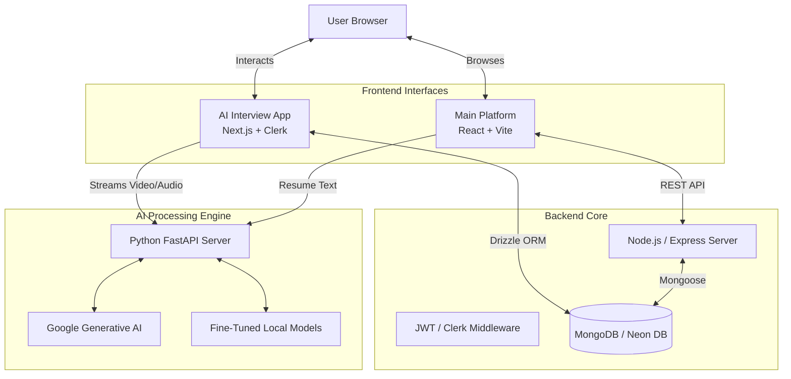

# WCareer (WCareers.ai) 🚀🏆

<div align="center">

**A 3x National Hackathon Winning AI-powered career advancement platform. WCareer seamlessly integrates Generative AI to provide personalized mock interviews, smart resume building, and dynamic career roadmaps.**

[](#)
<br>
[](https://nextjs.org/)
[](https://reactjs.org/)
[](https://www.python.org/)
[](https://www.mongodb.com/)
[](https://opensource.org/licenses/MIT)

[Award-Winning Features](#-award-winning-features) • [Enterprise Architecture](#-enterprise-ai-architecture) • [Quick Start](#-quick-start)

</div>

---

## 📸 Project Media


*(Add screenshots of the AI Mock Interview interface, Resume Wizard, and Career Roadmap here)*

[Watch Demo Video](assets/demo.mp4)

---

## 🌟 Award-Winning Features

WCareer isn't just another job board; it's a complete career copilot that won national acclaim for its innovative use of machine learning.

✅ **Generative AI Mock Interviews** - Conduct realistic, dynamic interview scenarios powered by Google Generative AI. The system analyzes your tone, confidence, and technical accuracy in real-time.  
✅ **AI-Powered Career Roadmaps** - Generates personalized, step-by-step learning guides for career progression based on current industry trends.  
✅ **Resume Wizard & ATS Optimizer** - Smart resume enhancements with AI-driven suggestions tailored to bypass Application Tracking Systems.  
✅ **Adaptive Technical Assessments** - Dynamic tests that adjust in difficulty based on user performance to accurately gauge technical and personality insights.  
✅ **Predictive Job Recommendations** - A custom machine-learning pipeline that matches candidates with internships and jobs based on skill gaps and trajectory.  
✅ **Enterprise Security** - Secured by **Clerk** authentication, backed by **Drizzle ORM** and **Neon DB** for the Next.js module, alongside a robust MERN stack core.

---

## 🏗 Enterprise AI Architecture

WCareer is built using a highly scalable microservices architecture, separating the core web platform from the heavy-lifting Large Language Model processing server.



### Module Breakdown:
1. **Mock Interview Suite (`/mockInterview`)**: A cutting-edge Next.js 14 application utilizing Clerk Auth, Drizzle ORM, and direct API streams to Google Generative AI for real-time conversation analysis.
2. **Main Platform (`/client` & `/server`)**: A robust MERN stack handling the Resume Wizard, community forums, job boards, and user analytics (powered by `Chart.js`).
3. **LLM Server (`/llm-server`)**: A dedicated Python/FastAPI environment designed for data processing, resume parsing, and serving fine-tuned ML models.

---

## 🚀 Quick Start

Due to its microservices architecture, you will need to boot up the respective servers.

### 1. Main Backend (Node.js)
```bash
cd server
npm install
npm run dev
```

### 2. Main Frontend (React)
Open a new terminal:
```bash
cd client
npm install
npm run dev
```

### 3. AI Mock Interview Module (Next.js)
Open a new terminal:
```bash
cd mockInterview
npm install
npm run dev
```

### 4. LLM / Python Server
Open a new terminal:
```bash
# Requires Python 3.9+
cd llm-server
pip install -r requirements.txt
python server.py
```

*(Ensure all `.env` files are properly populated with your MongoDB URI, Clerk Keys, and Google AI Studio API Keys).*

---

## 📚 Complete Documentation

For an in-depth look at how we won the nationals and how the codebase functions, please refer to our extensive technical docs:
- **[Comprehensive Project Documentation](COMPREHENSIVE_PROJECT_DOCUMENTATION.md)**
- **[Backend Architecture Guide](Backend.md)**
- **[Feature Breakdown](Features.md)**

---

## 🤝 Contributing

We welcome contributions to WCareer!
1. Fork the repository
2. Create your feature branch (`git checkout -b feature/AdvancedAnalytics`)
3. Commit your changes
4. Push to the branch
5. Open a Pull Request

---

## 📝 License

This project is licensed under the MIT License.

<div align="center">
<b>Building the future of careers with AI.</b>
</div>
